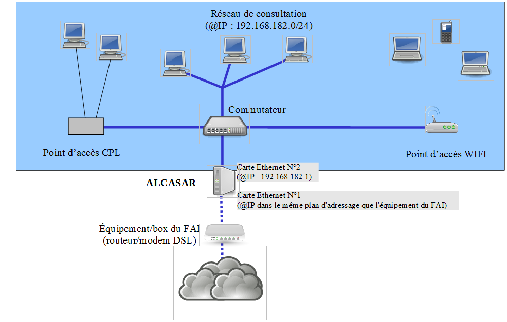

============
Installation
============

Introduction
============

Ce document décrit la procédure d’installation du portail ALCASAR. Il est complété par trois autres documents : le document de présentation,
le document d’exploitation et la documentation technique.

Si vous possédez déjà une version d’ALCASAR fonctionnelle et que vous désirez effectuer une mise à jour, reportez-vous à la documentation d’exploitation (chapitre « mise à jour »).

ALCASAR peut être installé sur un ordinateur standard équipé de deux cartes réseau Ethernet. La première est connectée à l’équipement du Fournisseur d’Accès Internet (FAI).
La deuxième est connectée au commutateur utilisé pour desservir le réseau des stations de consultation.

Par défaut, l’adresse IP de cette deuxième carte réseau est : 192.168.182.1/24. Cela permet de disposer d’un plan d’adressage de classe C (254 équipements).
Ce plan d’adressage est modifiable lors de l’installation. Pour tous les équipements situés sur le réseau de consultation, ALCASAR est le serveur DHCP,
le serveur DNS, le serveur de temps et le « routeur par défaut (default gateway) ».
**Ainsi, sur ce réseau, il ne doit y avoir aucun autre routeur ou serveur DHCP** (vérifiez bien vos points d’accès WIFI).

**Exemple d’un plan d’adressage de classe C (254 équipements)**

* adresses IP disponibles : de 192.168.182.2 à 192.168.182.254 (statiques ou dynamiques)
* masque de réseau : 255.255.255.0
* adresses des serveurs DNS et du routeur par défaut (default gateway) : 192.168.182.1 (adresse IP d’ALCASAR)
* suffixe DNS pour les équipements en adressage fixe : « localdomain »

**Exemple d’un plan d’adressage de classe B (65534 équipements)**

* Adresse IP d’ALCASAR : 172.16.0.1/16
* Nombre maximum d’équipements sur le réseau de consultation : 65531
* Paramètre des équipements de consultation :

  * adresses IP disponibles : de 172.16.0.2 à 172.16.255.254 (statiques ou dynamiques)
  * masque de réseau : 255.255.0.0
  * adresses des serveurs DNS et du routeur par défaut (default gateway) : 172.16.0.1 (adresse IP d’ALCASAR)
  * suffixe DNS pour les équipements en adressage fixe : « localdomain »

Bien que cela soit possible, il est déconseillé de définir un réseau de consultation en classe A (ex : 15.0.0.0/8).
En effet, le serveur DHCP interne d’ALCASAR devra alors réserver et gérer plus de 16 millions d’adresses IP.
La gestion d’un tel volume d’adresses est très gourmande en ressource système et mémoire.

Installation
============

L’installation du portail s’effectue en deux étapes.
La première étape est l’installation d’un système Linux minimaliste basé sur Mageia 4.1.
La deuxième étape permet d’installer et de configurer les différentes briques logicielles constituant ALCASAR.

Besoins matériels
-----------------

ALCASAR n’exige qu’un PC bureautique standard possédant 2 cartes réseau et un disque dur d’une capacité de 100Go au minimum afin d’être en mesure de stocker
les fichiers journaux liés à la traçabilité des connexions.
Les architectures 32 bits et 64 bits sont supportées et automatiquement prises en compte.
ALCASAR intègre plusieurs systèmes optionnels de filtrage (protocoles réseau, adresses IP, URL, noms de domaines et antimalware).
Si vous décidez d’activer ces systèmes de filtrage, il est recommandé d’installer au moins 8 GO de mémoire vive afin d’assurer une rapidité de traitement acceptable
(ALCASAR aime la RAM ;-) ).

.. note:: Cas d’une Machine Virtuelle : la taille du disque dur virtuel **ne doit pas être inférieure à 25G**.

Installation du système
-----------------------

La procédure d’installation de ce système est la suivante (durée estimée : 6’) :

* récupérez l’image ISO du DVD de Mageia4.1 double architecture (32 et 64 bits) : fichier « mageia4.1-dual-DVD.iso » (1GB).
  Cette image ISO est disponible sur le site d’ALCASAR ainsi que sur les `sites miroirs Mageia <http://mirrors.mageia.org/>`_.
  Par exemple :

  * http://www.mirrorservice.org/sites/mageia.org/pub/mageia/iso/4.1/
  * http://distrib-coffee.ipsl.jussieu.fr/pub/linux/Mageia/iso/4.1/

* gravez cette image sur un DVD-ROM ou créez une clé USB amorçable1. Vous pouvez aussi utiliser un disque dur externe simulant un périphérique
  amorçable (ex : zalman zm-ve300 ou 400).
* modifiez les paramètres BIOS du PC afin de supprimer l’option « Secure Boot », de régler la date, l’heure et afin de permettre l’amorçage du PC
  à partir d’un DVD-ROM ou d’une clé USB. À la fin de l’installation, modifiez une nouvelle fois les paramètres BIOS pour limiter les possibilités
  d’amorçage du PC au seul disque dur ;
* insérez le DVD-ROM ou la clé USB, redémarrez le PC et suivez les instructions suivantes :

+-------------------------------------------------------+-----------------------------------------------------------------+-------------------------------------------+
|  Messages affichés à l'écran                          |      Commentaires                                               |      Actions à réaliser                   |
+=======================================================+=================================================================+===========================================+
|.. image:: images/mageia_installation_menu.png         || Après démarrage du PC, cette page d’accueil est présentée.     | Sélectionnez « Install Mageia 4 ».        |
|                                                       ||                                                                |                                           |
|                                                       ||  * si le mode graphique n’apparaît pas, vous devez configurer  |                                           |
|                                                       ||  le BIOS du PC afin d’allouer plus de 2Mo de la mémoire        |                                           |
|                                                       ||  partagée pour la carte graphique.                             |                                           |
+-------------------------------------------------------+-----------------------------------------------------------------+-------------------------------------------+
|.. image:: images/mageia_installation_choix_langue.png |                                                                 || Séletionnez votre langue.                |
|                                                       |                                                                 ||                                          |
+-------------------------------------------------------+-----------------------------------------------------------------+-------------------------------------------+
|.. image:: images/mageia_installation_licence.png      || Ce contrat explique que les logiciels installés sont des       || Acceptez le contrat de licence.          |
|                                                       || logiciels libres.                                              ||                                          |
+-------------------------------------------------------+-----------------------------------------------------------------+-------------------------------------------+
|.. image:: images/mageia_installation_clavier.png      ||                                                                || Sélectionnez votre type de               |
|                                                       ||                                                                || clavier.                                 |
+-------------------------------------------------------+-----------------------------------------------------------------+-------------------------------------------+
|.. image:: images/mageia_installation_partition.png    || Le partitionnement du disque dur sera adapté au besoin         || Sélectionnez                             |
|                                                       || d’ALCASAR (cf. étape suivante).                                || « Partitionnement de                     |
|                                                       ||                                                                || disque personnalisé ».                   |
+-------------------------------------------------------+-----------------------------------------------------------------+-------------------------------------------+
|.. image:: images/mageia_installation_partition_2.png  || Après avoir supprimé toutes les partitions, créez les 5        || Cliquez sur « Supprimer toutes les       |
|                                                       || partitions suivantes :                                         || partitions ».                            |
|                                                       ||                                                                ||                                          |
|                                                       || - / : 4 Go                                                     || Cliquez ensuite à l’intérieur de la zone |
|                                                       || - swap : gardez la taille proposée                             || grise du disque (sda) pour               |
|                                                       || - /tmp : 4 Go                                                  || créer chaque nouvelle partition.         |
|                                                       || - /home : 4 Go                                                 ||                                          |
|                                                       || - /var : le reste du disque dur (**taille supérieure à 10G,**  || Info : mise à part la partition de       |
|                                                       ||   **même sur unemachine virtuelle**).                          || « swap », tous les Systèmes de           |
|                                                       |                                                                 || Fichiers (SF) sont du type .             |
|                                                       |                                                                 || « Journalized FS : ext4 »                |
+-------------------------------------------------------+-----------------------------------------------------------------+-------------------------------------------+
|.. image:: images/mageia_installation_partition_3.jpg  | .. image:: images/mageia_installation_partition_4.jpg           || Créez la partition racine (/).           |
|                                                       ||                                                                || Choisissez sa taille (4 Go) ainsi        |
|                                                       || À la fin de cette opération, et en fonction de la taille de    ||  que son système de fichier (ext4).      |
|                                                       || votre disque dur, le partitionnement devrait ressembler à      ||                                          |
|                                                       || l'image ci-dessus.                                             || Recommencez cette étape pour             |
|                                                       |                                                                 || toutes les autres partitions.            |
|                                                       |                                                                 ||                                          |
|                                                       |                                                                 || Une fois le partitionnement              |
|                                                       |                                                                 || effectué, cliquez sur « Terminer ».      |
+-------------------------------------------------------+-----------------------------------------------------------------+-------------------------------------------+
|.. image:: images/mageia_installation_media.png        | Pour ALCASAR, l'installation ne nécessaite pas d'autre média.   || Sélectionnez "Aucun" puis                |
|                                                       |                                                                 || cliquer sur "Suivant"                    |
+-------------------------------------------------------+-----------------------------------------------------------------+-------------------------------------------+
|.. image:: images/mageia_installation_media_2.png      |                                                                 || Laissez le média                         |
|                                                       |                                                                 || « Nonfree release » activé               |
|                                                       |                                                                 || puis cliquez sur « Suivant ».            |
+-------------------------------------------------------+-----------------------------------------------------------------+-------------------------------------------+
|.. image:: images/mageia_installation_paquetage.png    || Sélection des groupes de paquetages à installer :              || Choisissez « Désélectionner tous »       |
|                                                       || ALCASAR ne nécessite qu’une installation très minimaliste du   || puis cliquez sur  « Suivant ».           |
|                                                       || système.                                                       ||                                          |
|                                                       ||                                                                ||  Info : sous Linux, un paquetage         |
|                                                       ||                                                                || est un fichier archive contenant         |
|                                                       ||                                                                || tous les constituants d’un logiciel      |
|                                                       ||                                                                || (binaires, fichiers d’aide,              |
|                                                       ||                                                                || fichiers de configuration, etc.).        |
|                                                       ||                                                                ||                                          |
+-------------------------------------------------------+-----------------------------------------------------------------+-------------------------------------------+
|.. image:: images/mageia_installation_paquetage_2.png  ||                                                                || Sélectionnez « Installer les             |
|                                                       ||                                                                || paquetages suggérés » ainsi que          |
|                                                       ||                                                                || la documentation, puis cliquez sur       |
|                                                       ||                                                                || « suivant »                              |
|                                                       ||                                                                || La copie des paquetages sur le           |
|                                                       ||                                                                || disque dur est alors lancée.             |
|                                                       ||                                                                || Durée estimée : 2’                       |
+-------------------------------------------------------+-----------------------------------------------------------------+-------------------------------------------+
|.. image:: images/mageia_installation_utilisateurs.png ||                                                                || Affectez le mot de passe au compte       |
|                                                       ||                                                                || « root » puis créez le compte            |
|                                                       ||                                                                || « sysadmin » et affectez-lui             |
|                                                       ||                                                                || un mot de passe.                         |
|                                                       ||                                                                ||                                          |
+-------------------------------------------------------+-----------------------------------------------------------------+-------------------------------------------+
|.. image:: images/mageia_installation_config.png       || Configuration de l’accès à Internet.                           || Cliquez sur « Configurer » de            |
|                                                       ||                                                                || la rubrique « Réseau-ethernet »          |
|                                                       ||                                                                || du groupe « Réseau et Internet ».        |
|                                                       ||                                                                ||                                          |
+-------------------------------------------------------+-----------------------------------------------------------------+-------------------------------------------+
|.. image:: images/mageia_installation_internet.png     ||                                                                || Sélectionnez le type de connexion à      |
|                                                       ||                                                                || Internet. Dans le cas d’une « box »      |
|                                                       ||                                                                || de FAI, choisissez                       |
|                                                       ||                                                                || « Filaire (Ethernet) ».                  |
|                                                       ||                                                                ||                                          |
|                                                       ||                                                                || *Info* : ALCASAR n’a pas été testé       |
|                                                       ||                                                                || avec les autres méthodes de              |
|                                                       ||                                                                || connexion à Internet.                    |
|                                                       ||                                                                ||                                          |
+-------------------------------------------------------+-----------------------------------------------------------------+-------------------------------------------+
|.. image:: images/mageia_installation_internet_2.png   || On ne configure pour l’instant que l’interface connectée       || Sélectionnez l’interface à configurer.   |
|                                                       || à la « box » du FAI.                                           ||                                          |
|                                                       || La deuxième interface qui est connectée au réseau de           || *Conseil* : choisissez l’interface avec  |
|                                                       || consultation sera paramétrée plus tard, lors de l’installation || le plus petit index. **Notez le nom de** |
|                                                       || d’ALCASAR.                                                     || **cette interface.**                     |
|                                                       ||                                                                ||                                          |
|                                                       ||                                                                || *Info* : Les noms des interfaces sont    |
|                                                       ||                                                                || liés à l’architecture physique des PC.   |
|                                                       ||                                                                || Ils peuvent donc être différents de la   |
|                                                       ||                                                                || copie d’écran.                           |
|                                                       ||                                                                ||                                          |
+-------------------------------------------------------+-----------------------------------------------------------------+-------------------------------------------+
|.. image:: images/mageia_installation_internet_3.png   ||                                                                || Sélectionnez « configuration manuelle ». |
|                                                       ||                                                                ||                                          |
|                                                       ||                                                                || *Info* : Bien qu’Alcasar soit            |
|                                                       ||                                                                || compatible avec le protocole             |
|                                                       ||                                                                || « bootp/DHCP » nous conseillons la       |
|                                                       ||                                                                || configuration manuelle d’un adressage    |
|                                                       ||                                                                || fixe.                                    |
+-------------------------------------------------------+-----------------------------------------------------------------+-------------------------------------------+
|.. image:: images/mageia_installation_internet_4.png   || Exemple :                                                      || Entrez les paramètres de cette interface.|
|                                                       || - Adresse IP : cette adresse doit être dans le même sous-réseau||                                          |
|                                                       || que l’adresse de la passerelle d’accès à Internet (box).       || * Inscrivez les adresses des serveurs de |
|                                                       || - Masque : 255.255.255.0                                       || DNS fournies par votre FAI. Vous pouvez  |
|                                                       || - Passerelle : c’est l’adresse de la box (en général           || bien sûr utiliser d’autres serveurs DNS. |
|                                                       ||   192.168.1.1 pour une « livebox » et                          || Exemple :                                |
|                                                       ||   192.168.0.254 pour une « freebox »)                          || - projet libre « OpenNIC » (voir leur    |
|                                                       || - DNS 1 et DNS 2 :*                                            ||   site WEB pour les adresses les plus    |
|                                                       || - « nom d’hôte » : laissez ce champ vide                       ||   proches de chez vous)                  |
|                                                       ||                                                                || - projet « OpenDNS »                     |
|                                                       ||                                                                ||   (DNS1=208.67.222.222,                  |
|                                                       ||                                                                ||    DNS2=208.67.220.220)                  |
|                                                       ||                                                                || - google (DNS1=8.8.8.8, DNS2=8.8.4.4).   |
|                                                       ||                                                                ||                                          |
+-------------------------------------------------------+-----------------------------------------------------------------+-------------------------------------------+
|.. image:: images/mageia_installation_internet_5.png   ||                                                                || Sélectionnez uniquement « Lancer la      |
|                                                       ||                                                                || connexion au démarrage ».                |
|                                                       ||                                                                ||                                          |
+-------------------------------------------------------+-----------------------------------------------------------------+-------------------------------------------+
|.. image:: images/mageia_installation_internet_6.png   || Il n’est pas nécessaire de lancer cette connexion à ce stade   || Sélectionnez « Non »                     |
|                                                       ||                                                                ||                                          |
+-------------------------------------------------------+-----------------------------------------------------------------+-------------------------------------------+
|.. image:: images/mageia_installation_internet_7.png   ||                                                                || Cliquez sur « Terminer ».                |
|                                                       ||                                                                ||                                          |
+-------------------------------------------------------+-----------------------------------------------------------------+-------------------------------------------+
|.. image:: images/mageia_installation_config_2.png     ||                                                                || Cliquez sur « Suivant ».                 |
|                                                       ||                                                                ||                                          |
+-------------------------------------------------------+-----------------------------------------------------------------+-------------------------------------------+
|.. image:: images/mageia_installation_mise_a_jour.png  || Les mises à jour de sécurité seront gérées pendant             || Sélectionnez « Non » et cliquez sur      |
|                                                       || l’installation d’ALCASAR.                                      || « Suivant ».                             |
|                                                       ||                                                                ||                                          |
+-------------------------------------------------------+-----------------------------------------------------------------+-------------------------------------------+
|.. image:: images/mageia_installation_felicitation.png || L’installation est terminée                                    || Cliquez sur « Redémarrage ».             |
|                                                       ||                                                                || Retirez le CDROM ou la clé USB.          |
|                                                       ||                                                                || Reconfigurez le BIOS afin de limiter les |
|                                                       ||                                                                || possibilités d’amorçage au seul          |
|                                                       ||                                                                || disque dur.                              |
|                                                       ||                                                                ||                                          |
+-------------------------------------------------------+-----------------------------------------------------------------+-------------------------------------------+

Installation d'ALCASAR
----------------------

Configuration des cartes réseau
^^^^^^^^^^^^^^^^^^^^^^^^^^^^^^^

+-------------------------------------------------------+-----------------------------------------------------------------+-------------------------------------------+
|  Messages affichés à l'écran                          |      Commentaires                                               |      Actions à réaliser                   |
+=======================================================+=================================================================+===========================================+
|.. image:: images/alcasar_installation_reseau.png      || Déconnectez les câbles des deux cartes réseau.                 |                                           |
|                                                       || Connectez-vous en tant que « root ».                           |                                           |
|                                                       ||                                                                |                                           |
+-------------------------------------------------------+-----------------------------------------------------------------+-------------------------------------------+
|                                                       || Lancez le clignotement des LEDs de ’interface réseau configurée|| ``ethtool -p  enp0s3``                   |
|                                                       || précédemment (« enp0s3 » dans notre exemple)                   ||                                          |
|                                                       ||                                                                || Connectez le câble provenant de la box   |
|                                                       ||                                                                || sur l’interface réseau dont les LED      |
|                                                       ||                                                                || clognotent.                              |
|                                                       ||                                                                ||                                          |
|                                                       ||                                                                || ``<Ctrl> + c``                           |
|                                                       ||                                                                ||                                          |
|                                                       ||                                                                || *Info* : remplacez « enp0s3 » par le nom |
|                                                       ||                                                                || de l’interface réseau configurez         |
|                                                       ||                                                                || précédemment. Les ommandes « ifconfig »  |
|                                                       ||                                                                || ou « ip link » affiche le nom des        |
|                                                       ||                                                                || interfaces réseau présentes sur votre    |
|                                                       ||                                                                || machine.                                 |
|                                                       ||                                                                ||                                          |
+-------------------------------------------------------+-----------------------------------------------------------------+-------------------------------------------+
|.. image:: images/alcasar_installation_reseau_2.png    || Vérifiez que la lien est bien actif sur l’interface configurée || ``watch  ethtool  enp0s3``               |
|                                                       ||                                                                ||                                          |
|                                                       ||                                                                || *Info* : a dernière ligne affichée       |
|                                                       ||                                                                || présente l’état du lien sur la carte     |
|                                                       ||                                                                || (Link detected <yes/no>)                 |
|                                                       ||                                                                || Si le lien n’est pas actif, connectez le |
|                                                       ||                                                                || câble sur l’autre carte. Dès que le lien |
|                                                       ||                                                                || est activé, stoppez la commande à l’aide |
|                                                       ||                                                                || de la séquence de touches :``<Ctrl> + c``|
|                                                       ||                                                                ||                                          |
+-------------------------------------------------------+-----------------------------------------------------------------+-------------------------------------------+
|                                                       || Effectuez la même vérification avec la deuxième carte et le    || ``watch  ethtool  xxxxxxx``              |
|                                                       || câble provenant du venant du réseau de consultation.           ||                                          |
|                                                       ||                                                                || *Info* : côté réseau de consultation,    |
|                                                       ||                                                                || connectez un quipement actif de réseau   |
|                                                       ||                                                                || (commutateur Ethernet, CPL, AP WIFI,etc.)|
|                                                       ||                                                                || afin d’être assuré de la permanence du   |
|                                                       ||                                                                || lien même si les stations sont éteintes. |
|                                                       ||                                                                || machine.                                 |
|                                                       ||                                                                ||                                          |
+-------------------------------------------------------+-----------------------------------------------------------------+-------------------------------------------+
|.. image:: images/alcasar_installation_test_reseau.png || Testez la connectivité Internet                                || ``ping  -c3 www.google.fr``              |
|                                                       ||                                                                ||                                          |
+-------------------------------------------------------+-----------------------------------------------------------------+-------------------------------------------+

Récupération du fichier d’installation
^^^^^^^^^^^^^^^^^^^^^^^^^^^^^^^^^^^^^^

Ce fichier est une archive compressée nommée : alcasar-x.y.tar.gz (’x.y’ correspond au numéro de version désiré).
Vous pouvez le télécharger de deux manières (clé USB ou FTP) :

Via une clé USB
"""""""""""""""

Récupérez la dernière version de ce fichier sur le site Internet d’ALCASAR et copiez-le sur une clé USB.

Suivez la procédure suivante pour le copier sur le PC ALCASAR :

+-------------------------------------------------------+-----------------------------------------------------------------+-------------------------------------------+
|  Messages affichés à l'écran                          |      Commentaires                                               |      Actions à réaliser                   |
+=======================================================+=================================================================+===========================================+
|.. image:: images/alcasar_installation_usb.png         || Insérez la clé USB                                             ||                                          |
|                                                       ||                                                                || ``fdisk  -l``                            |
|                                                       || Affichez les informations relatives aux supports de masse afin ||                                          |
|                                                       || de récupérer le om du périphérique associé à votre clé.        || *Info* : vous pouvez aussi afficher le   |
|                                                       || Dans l’exemple joint, « /dev/sdb1 » correspond à une clé       || journal système avant d’insérer la clé   |
|                                                       || de 1Go.                                                        || pour récupérer ce nom                    |
|                                                       ||                                                                || (``journalctrl  -f)``)                   |
|                                                       ||                                                                ||                                          |
+-------------------------------------------------------+-----------------------------------------------------------------+-------------------------------------------+
|.. image:: images/alcasar_installation_usb_2.png       |                                                                 | .. code-block:: bash                      |
|                                                       |                                                                 |                                           |
|                                                       | #. Créez un répertoire et ’montez’ la clé sur celui-ci.         |   mkdir -p /media/usb                     |
|                                                       | #. Copiez l’archive d’ALCASAR dans le répertoire /root.         |   mount /dev/sdb1 /media/usb/             |
|                                                       | #. Démontez la clé USB.                                         |   cp /media/usb/alcasar-* /root/          |
|                                                       | #. Retirez-la.                                                  |   umount /media/usb                       |
|                                                       |                                                                 |                                           |
|                                                       |                                                                 || *info* : emplacez « sdb1 » par le nom du |
|                                                       |                                                                 || périphérique récupéré à l’étape .        |
|                                                       |                                                                 || précédente                               |
|                                                       |                                                                 ||                                          |
+-------------------------------------------------------+-----------------------------------------------------------------+-------------------------------------------+

Par FTP
"""""""

Depuis le PC ALCASAR, récupérez la dernière version de ce fichier situé sur le serveur FTP :

+-------------------------------------------------------+-----------------------------------------------------------------+-------------------------------------------+
|  Messages affichés à l'écran                          |      Commentaires                                               |      Actions à réaliser                   |
+=======================================================+=================================================================+===========================================+
|.. image:: images/alcasar_installation_ftp.jpg         | #. Connectez-vous au serveur FTP avec la commande « lftp »      | .. code-block:: bash                      |
|                                                       | #. déplacez-vous dans le répertoire  stable » et listez         |                                           |
|                                                       |    son contenu                                                  |   lftp ftp.alcasar.net/pub                |
|                                                       | #. Récupérez le fichier                                         |   cd stable                               |
|                                                       | #. Quittez                                                      |   ls                                      |
|                                                       |                                                                 |   get alcasar-x.y.tar.gz                  |
|                                                       |                                                                 |   bye                                     |
|                                                       |                                                                 |                                           |
+-------------------------------------------------------+-----------------------------------------------------------------+-------------------------------------------+

Installation
^^^^^^^^^^^^

+-------------------------------------------------------+-----------------------------------------------------------------+-------------------------------------------+
|  Messages affichés à l'écran                          |      Commentaires                                               |      Actions à réaliser                   |
+=======================================================+=================================================================+===========================================+
|.. image:: images/alcasar_installation_archive.png     || Calculez l’empreinte numérique SHA256' de cette archive et     ||                                          |
||                                                      || comparez-la avec celle du site WEB.                            || ``sha256sum  alcasar-x.y.tar.gz``        |
|.. image:: images/alcasar_installation_archive_2.png   ||                                                                ||                                          |
|                                                       ||                                                                || *Info* : si l’empreinte numérique ne     |
|                                                       ||                                                                || correspond pas, éléchargez à nouveau     |
|                                                       ||                                                                || l’archive sur le site WEB. En cas de     |
|                                                       ||                                                                || nouveau problème, prévenez l’équipe de   |
|                                                       ||                                                                || développement via le forum.              |
|                                                       ||                                                                ||                                          |
+-------------------------------------------------------+-----------------------------------------------------------------+-------------------------------------------+
|.. image:: images/alcasar_installation_archive_3.png   | #. Décompressez et extrayez cett archive                        | .. code-block:: bash                      |
||                                                      | #. Positionnez-vous dans le répertoire d’ALCASAR                |                                           |
|.. image:: images/alcasar_installation_archive_4.png   | #. lancez le script d’installation.                             |   tar  -xvf  alcasar-x.y.tar.gz           |
|                                                       |                                                                 |   cd  alcasar-x.y                         |
|                                                       |                                                                 |   sh alcasar.sh  -i                       |
|                                                       |                                                                 ||                                          |
+-------------------------------------------------------+-----------------------------------------------------------------+-------------------------------------------+
|.. image:: images/alcasar_installation_license.png     || Acceptation de la licence                                      || ALCASAR est un logiciel libre développé  |
|                                                       || comparez-la avec celle du site WEB.                            || sous licence GPLV3.                      |
|                                                       ||                                                                ||                                          |
+-------------------------------------------------------+-----------------------------------------------------------------+-------------------------------------------+
|.. image:: images/alcasar_installation_t_internet.png  || Les tests d’accès à Internet sont réalisés.                    ||                                          |
|                                                       ||                                                                ||                                          |
+-------------------------------------------------------+-----------------------------------------------------------------+-------------------------------------------+
|.. image:: images/alcasar_installation_paquetage.png   || L’installation d’une centaine de logiciels (paquetages) est    ||                                          |
|                                                       || effectuée à partir d’Internet. Durée : 3'                      ||                                          |
|                                                       ||                                                                ||                                          |
+-------------------------------------------------------+-----------------------------------------------------------------+-------------------------------------------+
|.. image:: images/alcasar_installation_organisme.png   || Entrez le nom de votre organisme (sans espace)                 || Exemple : rasacla                        |
|                                                       ||                                                                ||                                          |
|                                                       ||                                                                || *Info* : ce nom est obligatoire.         |
|                                                       ||                                                                || les seuls caractères acceptés sont :     |
|                                                       ||                                                                || [a-z][A-Z][0-9][-]                       |
|                                                       ||                                                                ||                                          |
+-------------------------------------------------------+-----------------------------------------------------------------+-------------------------------------------+
|.. image:: images/alcasar_installation_ip.png          || Vous pouvez changer l’adresse IP d’ALCASAR et le plan          || Tapez « O » ou « N »                     |
|                                                       || d’adressage par défaut du réseau de consultation.              ||                                          |
|                                                       ||                                                                || *Info* : si vous tapez « n », le script  |
|                                                       ||                                                                || vous demandera l’adresse IP d’ALCASAR et |
|                                                       ||                                                                || le masque de réseau au format CIDR       |
|                                                       ||                                                                || (ex : 172.16.0.1/16).                    |
|                                                       ||                                                                ||                                          |
+-------------------------------------------------------+-----------------------------------------------------------------+-------------------------------------------+
|.. image:: images/alcasar_installation_compte.png      || Entrez l’identifiant et le mot de passe d’un premier compte    || *Info* : Ce compte sert à administrer    |
|                                                       || d’administration d’ALCASAR.                                    || ALCASAR au moyen de l’interface          |
|                                                       ||                                                                || graphique située à l’URL http://alcasar. |
|                                                       ||                                                                || Ce n’est pas un compte usager permettant |
|                                                       ||                                                                || de se connecter à Internet.              |
|                                                       ||                                                                || (ex : 172.16.0.1/16).                    |
|                                                       ||                                                                ||                                          |
+-------------------------------------------------------+-----------------------------------------------------------------+-------------------------------------------+
|.. image:: images/alcasar_installation_fin.png         || L’installation est terminée.                                   || Une fois le système relancé, démarrez un |
|                                                       || Le système va être relancé afin de synchroniser l’ensemble     || équipement de consultation et connectez- |
|                                                       || des constituants d’ALCASAR.                                    || vous sur l’interface de gestion du       |
|                                                       ||                                                                || portail afin de créer vos premiers       |
|                                                       ||                                                                || usagers (« http://alcasar »). Lisez      |
|                                                       ||                                                                || attentivement la                         |
|                                                       ||                                                                || documentation d’exploitation.            |
+-------------------------------------------------------+-----------------------------------------------------------------+-------------------------------------------+
|.. image:: images/alcasar_installation_verif.jpg       || Une fois le système relancé, vous pouvez vérifier que tous     || Si un ou plusieurs services n’ont pu être|
|                                                       || les composants d’ALCASAR sont bien lancés en vous connectant   || lancés, le script va tenter de le faire. |
|                                                       || et en lançant le script « alcasar-daemon.sh ».                 ||                                          |
|                                                       ||                                                                ||                                          |
+-------------------------------------------------------+-----------------------------------------------------------------+-------------------------------------------+

Arrêt, désinstallation, réinstallation ou mise à jour d’ALCASAR
---------------------------------------------------------------

Vous pouvez arrêter la machine ALCASAR soit en appuyant sur le bouton d’alimentation, soit en tapant la commande ``poweroff``, soit en utilisant de l’interface WEB d’administration.
Vous pouvez désinstaller le portail avec la commande ``sh alcasar.sh --uninstall``. Vous vous retrouvez alors comme si vous veniez d’installer uniquement le système d’exploitation.
En relançant l’installation ou en lançant l’installation d’une nouvelle version sur un ALCASAR actif (cf .§2), le script vous demandera si vous voulez effectuer une mise à jour.

Préparer une installation « hors ligne »
----------------------------------------

La procédure suivante permet d’installer ALCASAR en mode « hors ligne ».
Cela peut être utile quand on prévoit d’installer des machines ALCASAR dans une zone où l’accès Internet n’est pas encore disponible
ou que cet accès sera de débit très faible.
Dans ce cas, il faut pouvoir générer à l’avance un fichier archive contenant la totalité des paquetages (RPMS).
Ce fichier sera exploité en lieu et place du téléchargement Internet.

La procédure est la suivante :

- *préparation de l’archive des RPM* : sur une machine vierge connectée à Internet,
  installez le système Linux Mageia comme indiqué au §2.2 puis récupérez et décompressez l’archive d’ALCASAR.
  Déplacez-vous dans le répertoire des scripts ``cd alcasar-x.y/scripts/sbin`` et lancez le script ``./alcasar-rpm-download.sh``.
  Ce script va générer l’archive des RPM correspondant à l’architecture de la machine (32 ou 64 bits). Récupérez cette archive sur clé USB.
- *Installation hors ligne :* après avoir installé le système, récupérez votre archive de RPM. Décompressez-la et positionnez-vous dedans.
  Installez la totalité des RPM (``urpmi –no-verify-rpm *``). Procédez ensuite à l’installation d’ALCASAR comme indiqué au §2.3.
